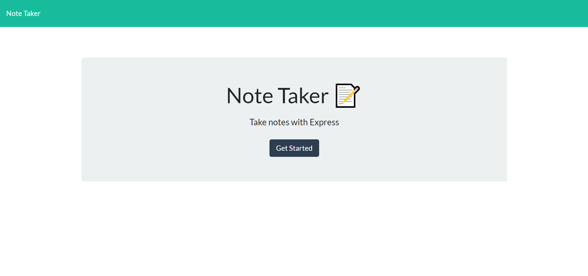

# Note Taker

This repo is for the UNCC coding bootcamp

## Instructions

Create an application that saves notes given and permanently writes it into a basic express server to be seen at any time.

## Screenshot

   

### Links

[Github Repo](https://github.com/adam-lowe/HW8-Note-Taker)

[Completed Work](https://stormy-plateau-23344.herokuapp.com/)